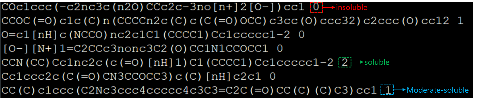

# Solubility_of_Molecules-CNNvsRNN-comparison
## Sections

- [Abstract](#Abstract)
- [Methodolgy](#Methodolgy)
- 
---

> ## Abstract
One of the important pyhsicochemical  feuteres of molecules is solubility. Nowadays, in the certain fields such as drug development, synthetic route and chemical process design, extraction and crystallisation: this phenomena is widely used. However, due to lack of consistent and reliable data in the literatures, there is still gap that needs to be fullfilled. Therefore, here we reported a machine learning approach which can predict solubility successfully. In this study we aimed to train SMILES dataset using two different architectures namely CNN and RNN to classify the solubuilty (3 classes will be discussed : Highly soluble, soluble, non-soluble) depending on their chemical structures. 

> ## Methodolgy
Since we are using supervised learning, the data was labeled as 0, 1, 2 for insoluble, moderate-soluble and soluble respectively. Total molecules for model is 193299. 
### Dataset view(SMILES+label)

> ## Model Architectures
This study compares two models namely Convolutional Neural Network(CNN) and Recurrent Neural Network (RNN).

## CNN

## RNN

